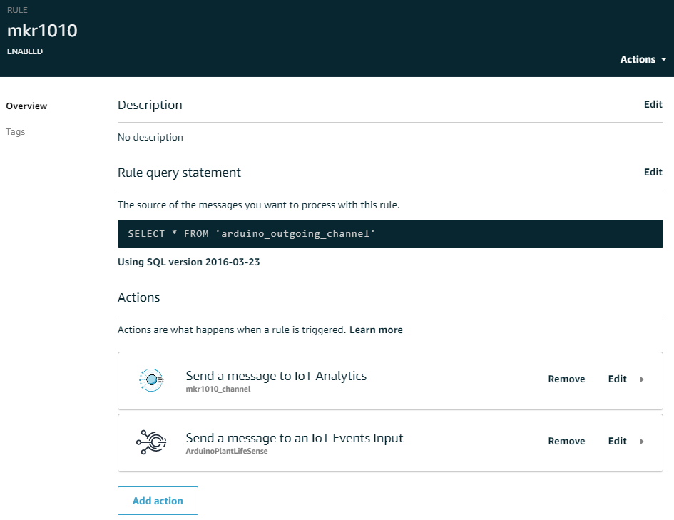

### Summary

ArudinoPlantLifeSense is AWS IoT based project, where the IoT thing comprises of plant having an Arduino controller and sensors connected to it. The arduino micro controller is periodically transmitting sensor values (moisture, temperature, pressure and others) of the plant to AWS IoT. The sensor values can be then analyzed and monitored via dashboards. Furthermore, in case the plant is in a dangerous state alerts can be sent out.

TLDR: Is it time to water this plant pot or not?

### Architecture

**1\. IoT thing -> (MQTT) -> AWS IoT**

The IoT thing for this project comprises of a [Arduino MKR Wifi 1010](https://store.arduino.cc/arduino-mkr-wifi-1010) (MKR Wifi) microcontroller, [Arduino MKR Env](https://store.arduino.cc/arduino-mkr-env-shield) (MKR Env) shield and a [Capacitive mositure sensor](https://wiki.dfrobot.com/Capacitive_Soil_Moisture_Sensor_SKU_SEN0193). Sensors on the MKR Env shield capture six environmental values (1) atmospheric pressure, (2) temperature, (3) ultraviolet UVA intensity, (4) ultraviolet UVB intensity, (5) UV index and (6) light intensity whereas the capacitive moisture sensor captures moisture data only.

For secure communication the IoT thing needs to be registered in [AWS IoT Core](https://aws.amazon.com/iot-core/) before it can start transmitting data. The certificate based setup process is described by Arduino [here](https://create.arduino.cc/projecthub/Arduino_Genuino/securely-connecting-an-arduino-mkr-wifi-1010-to-aws-iot-core-a9f365). The IoT thing uses the sketch [ArduinoPlantLifeSense.ino](https://github.com/lawansubba/ArduinoPlantLifeSense/blob/main/ArduinoPlantLifeSense.ino) to periodically transmit all the collected sensor data periodically to AWS IoT Core using the [MQTT protocol](https://mqtt.org/).

**2\. AWS IoT Core**
[AWS IoT Core](/C:/Users/loyda/AppData/Local/Programs/Joplin/resources/app.asar/%28https:/aws.amazon.com/iot-core/%29 "(https://aws.amazon.com/iot-core/)") allows IoT devices to securely connect and transmit messages to AWS without the need for managing your own servers. Several communication protocols are supported including MQTT and HTTPS. Any number of IoT devices can be registered to communicate to AWS using AWS IoT Core and those devices can be managed on AWS directly. AWS IoT core makes it easier to connect your IoT device to other AWS services like S3, Kinesis and Lambda. Many of the AWS IoT services are free to use under the [free-tier](https://aws.amazon.com/free/?all-free-tier.sort-by=item.additionalFields.SortRank&all-free-tier.sort-order=asc) scheme but have some restrictions.

- Rule
    By using [Rules](https://docs.aws.amazon.com/iot/latest/developerguide/iot-rules.html) devices registered on AWS IoT core can interact with other AWS services. In a rule, first we define what messages to process and what actions to take on those messages. In the figure above we have defined the rule "mkr1010" it is set to handle all messages from the MQTT topic 'arduino\_outgoing\_channel'. For every incoming message on the topic, we have defined two actions.
    
- Topic
    The MQTT protocol operates using a message broker system. Clients define a [topic](https://docs.aws.amazon.com/iot/latest/developerguide/topics.html) before publishing messages. Other clients can subscribe to published messages by registering to message topics. In our project, the Adruino thing is publishing messages to the 'arduino\_outgoing\_channel', whereas the AWS IoT core rule is subscribing to messages sent on that topics. The message payload is adjustable as per the applications needs, the payload for our Arudino thing consists of the 7 sensor values and the UNIX Epoch time when the readings were taken in Json Format.
    
- Action
    The actions in AWS IoT core rule specify what to do when a rule is triggered. For the rule "mkr1010", the first action passes the message to [AWS IoT Analytics](https://aws.amazon.com/iot-analytics/) so that data can be collected and dashboards can be created to analyze the data. The second action passes the message to [AWS IoT Events](https://docs.aws.amazon.com/iotevents/latest/developerguide/what-is-iotevents.html) so that the state of the thing can be maintained and actions can be fired when important events take place.
    

**3\. AWS IoT Analytics**
[AWS IoT Analytics](https://aws.amazon.com/iot-analytics/) provides a simplified platform to collect, process, store and analyze large volumes of IoT data freeing us from having to run such an analytical platforms by ourselves. Before storing IoT data in a time-series data store, the data can be filtered, transformed and enriched as per our needs. After IoT data is collected in the AWS IoT Analytics datastore, the data can be analyzed by running ad-hoc queries on the built-in SQL query engine or complex analytics can be performed on the data using Jupyter notebooks. The three major components of AWS IoT Analytics are the channel, pipeline and datastore. Incoming messages are first sent to a [channel](https://docs.aws.amazon.com/iotanalytics/latest/userguide/create-channel.html) which collects the raw messages and publishes them to a pipeline. A [pipeline](https://docs.aws.amazon.com/iotanalytics/latest/userguide/create-pipeline.html) receives the messages from channel and enables us to process and filter each message before transferring them to a datastore for storage. The datastore is not a full fledged database but provides simple query functionality.

**4\. AWS IoT Events**
[AWS IoT Events](https://docs.aws.amazon.com/iotevents/latest/developerguide/what-is-iotevents.html) allows us to monitor the state of our IoT devices or fleet of devices for important events like failures or changes in state and take dedicated actions. Using IoT Events, it is easy to monitor for important events across an single device or entire fleet of devices. In order to detect important events for devices, AWS IoT events continuously monitors all incoming IoT device data. For each IoT device, we define a [detector model](https://docs.aws.amazon.com/iotevents/latest/developerguide/iotevents-detector-model.html) and select the relevant data sources for the IoT device. Next we need to model our device and define its various states. On each state we can define boolean logic that evaluates the incoming inputs and detects whether an event has occurred. When an important event does occur, it triggers a transition to another state. The states themselves can define actions to take place when the detector enters or exits the state.

For our project, we have the detector diagram shown below with 3 states (Init, Safe and Danger) and 2 transitions (wet and dry). The init state is only used for initialization and initializes the moisture and timestamp values to ones sent in the message. The [Capacitive mositure sensor](https://wiki.dfrobot.com/Capacitive_Soil_Moisture_Sensor_SKU_SEN0193) was calibrated at the start, on a glass of water it recorded a value of 377 and outside the glass completely dry is recorded  a value of 790. So the value 500 was taken arbitrarily as a borderline between safe and danger states of the device. 

After initialization, a wet transition takes place if the moisture value is less than 500 otherwise the dry transition occurs. In case of the wet transition, the device stays in a Safe state until the moisture value goes above 500 in which case the transition to Danger state occurs. An action shown below is defined to send an email using [AWS SNS](https://aws.amazon.com/sns/) to myself notifying that I need to water the plant when the state transitions to a Danger state.

**5\. Amazon QuickSight**
[Amazon QuickSight](https://aws.amazon.com/quicksight/) is a cloud based Business intelligence platform which enables the quick analysis and exploration of data in the various AWS services and external third-party data source. The serverless nature of Quicksight allows us to automatically scale to thousands of users without any need to manage the infrastructure ourselves. It lets us easily create and publish BI dashboards on dataset. The dashboards can be accessed from various devices and can be embedded into your own websites and applications. 

QuickSight can access data directly from the datastore in AWS IoT Analytics. The datastore stores all our sensor data from the IoT thing. Below is a dashboard that shows the data collected from our IoT thing.

**6\. Amazon Simple Notification Service (Amazon SNS)**
[Amazon SNS](https://aws.amazon.com/sns/) is messaging service on AWS allowing both application-to-application (A2A) and application-to-person (A2P) communication. The A2A functionality provides publish/subscribe approach for high-throughput, push-based, many-to-many messaging between applications. The A2P functionality enables us to send messages to people via email ,SMS and push notifications. AWS SNS is used by AWS IoT events to trigger email warning that the IoT thing is in a Dangerous state and to water the plant to bring it back to the Safe state.
